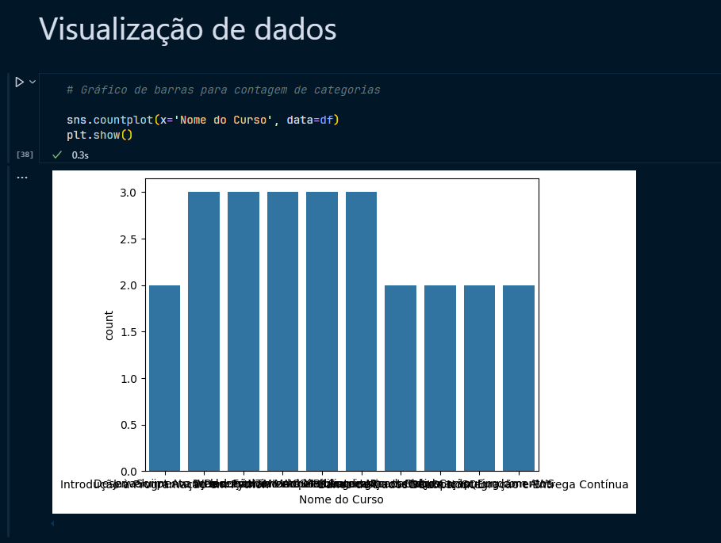
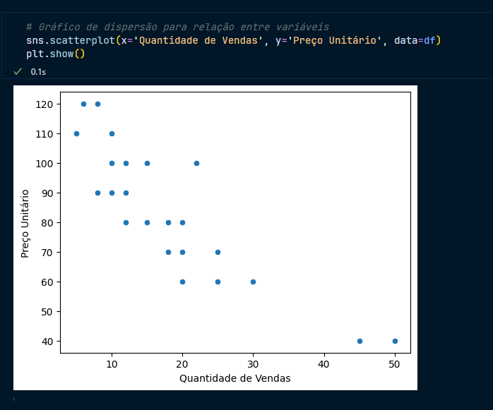
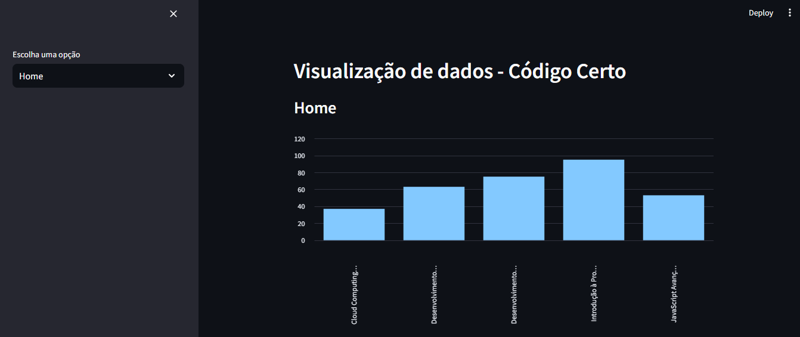

# Trilha Inicial 
## Código Certo 

Este projeto foi desenvolvido por Ícaro Santos como parte da trilha inicial de Ciência de Dados.
As tecnologias usadas foram:
`-> Python,`
`-> Pandas,`
`-> Matplotlib,`
`-> Seaborn,`
`-> Streamlit,`

## Sobre o projeto 

Para rodar o projeto, crie um ambiente virtual e rode o comando para instalar as dependências necessárias: 

```bash
pip install -r requirements.txt 

```

Para rodar a aplicação Streamlit, basta digitar o comando: 

```bash
streamlit run streamlit.py
```

### Requisitos Funcionais 
Foram apresentados os seguintes requisitos funcionais: 

`-> Carregamento de dados:` Para essa tarefa, foi utilizada a biblioteca Pandas´

```python
# Importar arquivo txt e exportar arquivo csv 
dados = pd.read_csv('dados.txt')
dados.to_csv('dados.csv', index=False)

# Importar arquivo csv 
df = pd.read_csv('dados.csv')
```

`-> Exploração de dados:` Para a exploração de dados também utilizei Pandas

```python
# Exploração de Dados
df.head() # Exibe as primeiras linhas
df.info()  # Informações básicas do conjunto de dados
```
`-> Estatísticas descritivas:`

```python
# Estatísticas Descritivas
df.describe()  # Estatísticas descritivas para colunas numéricas
```

`-> Visualização de dados:` Nessa parte foram utilizadas as bibliotecas Matplotlib e Seaborn tanto no arquivo analisys.py quanto nos arquivos streamlit.py e dash.py 



## Sobre os uso de Streamlit

Streamlit é um framework Python de código aberto desenvolvido para cientista de dados e engenheiros de IA/ML para construção de aplicações interativas.

Dentro do seu navegador, vai ser possível acessar a rota `http://localhost:8501/` onde a aplicação vai estar funcionando. 



Basta selecionar a opção que deseja ver na caixa de seleção que se encontra na barra lateral e poderá ter a mesma visualização de dados que é mostrada dentro do arquivo analisys.ipynb
